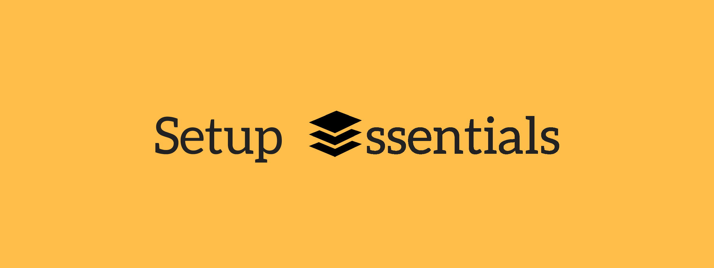

# Setup Essentials

This unique repository consists of different essential setup methods that I have figured out after debugging, trial &amp; error and hours of work. I am documenting these methods to make sure they come handy in future if needed.

Please follow the files in the [Essentials](https://github.com/nddave/Setup-Essentials/tree/master/Essentials) folder which lists necessary setup methods. More setup methods will be added periodically.

# License information 

This work is licensed under a [Creative Commons Attribution 4.0 International License](https://creativecommons.org/licenses/by/4.0/).
